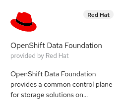

# Red Hat Hypershift on BareMetal

HyperShift is middleware for hosting OpenShift control planes at scale that solves for cost and time to provision, as well as portability cross cloud with strong separation of concerns between management and workloads. Clusters are fully compliant OpenShift Container Platform (OCP) clusters and are compatible with standard OCP and Kubernetes toolchains.  In the following blog I would like to show how one can enable and provision a Hypershift based cluster in OCP.

Before we begin lets start by describing the existing environment of the hub OCP cluster.   This hub cluster (kni20) is where the Hypershift operator will run and also the control plane of the secondary cluster we deploy with Hypershift.  It is a OCP 4.10.3 compact 3 node cluster running on baremetal.  The following operators have been installed for convience to provide the storage needed for Infrastructure Operator:

    

Along with installing and configuring the above operators we went ahead and set a default storageclass so that any requested persistent volume claims will be fulfilled automatically:

~~~bash
$ oc patch storageclass ocs-storagecluster-ceph-rbd -p '{"metadata": {"annotations":{"storageclass.kubernetes.io/is-default-class":"true"}}}'
storageclass.storage.k8s.io/ocs-storagecluster-ceph-rbd patched
~~~

At this point we can now start to configure this hub cluster for use with Hypershift.  First we need to install two additional required operators: Infrastructure Operator for Red Hat OpenShift and Hive.

    

We will be using the community operator for both but in the future Red Hat Advanced Cluster Management for Kubernetes will actually integrate Hypershift and this will not be required.

Once the Hive operator is installed create the basic Hive configuration yaml below:

~~~bash
cat << EOF > ~/hiveconfig.yaml
apiVersion: hive.openshift.io/v1
kind: HiveConfig
metadata:
  name: hive
spec:
  logLevel: debug
  targetNamespace: hive
EOF
~~~

Once the Hive config yaml is created apply it to the hub cluster to enable the running pods:

~~~bash
$ oc create -f hiveconfig.yaml 
hiveconfig.hive.openshift.io/hive created
~~~

After a few minutes verify that the pods have started by issuing the following oc command:

~~~bash
$ oc get po -n hive
NAME                                READY   STATUS    RESTARTS   AGE
hive-clustersync-0                  1/1     Running   0          21m
hive-controllers-76994cf6fd-cw6sr   1/1     Running   0          21m
hiveadmission-9dcd68cf7-ffmzd       1/1     Running   0          21m
hiveadmission-9dcd68cf7-m6sg5       1/1     Running   0          21m

~~~

If Hive is confirmed to be operatational move onto the Infrastructure Operators configuration.  Here we need to create an agent service configuration yaml that will tell the operator how much storage we need for the various components like database and filesystem and it will also define what OpenShift versions to maintain:

~~~bash
cat << EOF > ~/agentserviceconfig.yaml
apiVersion: agent-install.openshift.io/v1beta1
kind: AgentServiceConfig
metadata:
  name: agent
spec:
  databaseStorage:
    accessModes:
      - ReadWriteOnce
    resources:
      requests:
        storage: 10Gi
  filesystemStorage:
    accessModes:
      - ReadWriteOnce
    resources:
      requests:
        storage: 100Gi
  imageStorage:
    accessModes:
      - ReadWriteOnce
    resources:
      requests:
        storage: 10Gi
  mustGatherImages:
    - name: cnv
      openshiftVersion: '4.8'
      url: >-
        registry.redhat.io/container-native-virtualization/cnv-must-gather-rhel8:v2.6.5
    - name: ocs
      openshiftVersion: '4.8'
      url: registry.redhat.io/ocs4/ocs-must-gather-rhel8
    - name: lso
      openshiftVersion: '4.8'
      url: registry.redhat.io/openshift4/ose-local-storage-mustgather-rhel8
  osImages:
    - cpuArchitecture: x86_64
      openshiftVersion: '4.8'
      rootFSUrl: >-
        https://mirror.openshift.com/pub/openshift-v4/dependencies/rhcos/4.8/4.8.14/rhcos-live-rootfs.x86_64.img
      url: >-
        https://mirror.openshift.com/pub/openshift-v4/dependencies/rhcos/4.8/4.8.14/rhcos-4.8.14-x86_64-live.x86_64.iso
      version: 48.84.202109241901-0
    - cpuArchitecture: x86_64
      openshiftVersion: '4.9'
      rootFSUrl: >-
        https://mirror.openshift.com/pub/openshift-v4/dependencies/rhcos/4.9/4.9.0/rhcos-live-rootfs.x86_64.img
      url: >-
        https://mirror.openshift.com/pub/openshift-v4/dependencies/rhcos/4.9/4.9.0/rhcos-4.9.0-x86_64-live.x86_64.iso
      version: 49.84.202110081407-0
    - cpuArchitecture: arm64
      openshiftVersion: '4.9'
      rootFSUrl: >-
        https://mirror.openshift.com/pub/openshift-v4/aarch64/dependencies/rhcos/4.9/4.9.0/rhcos-4.9.0-aarch64-live-rootfs.aarch64.img
      url: >-
        https://mirror.openshift.com/pub/openshift-v4/aarch64/dependencies/rhcos/4.9/4.9.0/rhcos-4.9.0-aarch64-live.aarch64.iso
      version: 49.84.202110080947-0
    - cpuArchitecture: x86_64
      openshiftVersion: '4.10'
      rootFSUrl: >-
        https://mirror.openshift.com/pub/openshift-v4/dependencies/rhcos/4.10/4.10.3/rhcos-4.10.3-x86_64-live-rootfs.x86_64.img
      url: >-
        https://mirror.openshift.com/pub/openshift-v4/dependencies/rhcos/4.10/4.10.3/rhcos-4.10.3-x86_64-live.x86_64.iso
      version: 410.84.202201251210-0
EOF
~~~

Once the agent service configuration file is created apply it to the cluster:

~~~bash
[bschmaus@provisioning ~]$ oc create -f agent_service_config-kni20.yaml
agentserviceconfig.agent-install.openshift.io/agent created
~~~

After a few minutes validate that the pods for the Infrastructure operator have started:

~~~bash
$ oc get po -n assisted-installer
NAME                                       READY   STATUS    RESTARTS   AGE
agentinstalladmission-77bf8b8b8f-kcr8m     1/1     Running   0          27m
agentinstalladmission-77bf8b8b8f-ttxbg     1/1     Running   0          27m
assisted-image-service-0                   1/1     Running   0          27m
assisted-service-8876b7d45-9g2fb           2/2     Running   0          27m
infrastructure-operator-76d4b9c58f-ghvds   1/1     Running   0          32m
~~~

With our two required operators installed we can move onto patching the provisioning configuration to watch all namespaces:

~~~bash
$ oc patch provisioning provisioning-configuration --type merge -p '{"spec":{"watchAllNamespaces": true}}'
provisioning.metal3.io/provisioning-configuration patched
~~~

At this point we have completed all the pre-requisites configured for Hypershift to be deployed so now we can proceed with deploying Hypershift on the hub cluster.  To make deployment of Hypershift and our cluster easier lets go ahead and assign some basic variables that we can reuse during the rest of the installation process.  These variables include definitions like: namespace, cluster name, infrastructure environment, base domain, sshkey, pull-secret, machine CIDR, OCP release and arhitecture, Hypershift image location and kubeconfig of hub cluster.  Hypershift currently has to be installed via this method because there is no operator in Operator hub to deploy Hypershift.

~~~bash
NAMESPACE=kni21ns
CLUSTERNAME=kni21
INFRAENV=kni21infra
BASEDOMAIN=schmaustech.com
SSHKEY=~/.ssh/id_rsa.pub
PULLSECRETNAME=${INFRAENV}-pullsecret
MACHINE_CIDR_CLUSTER=192.168.0.0/24
OCP_RELEASE_VERSION="4.10.3"
OCP_ARCH="x86_64"
HYPERSHIFT_IMAGE=quay.io/hypershift/hypershift-operator:latest
KUBECONFIG=kubeconfig-kni20
PULLSECRET=pull-secret.json
~~~

With our variables defined let move onto creating a temporary directory for our Hypershift install:

~~~bash
$ mkdir /tmp/hypershift
$ cp ~/$KUBECONFIG /tmp/hypershift/
$ cp ~/$PULLSECRET /tmp/hypershift/
$ cd /tmp/hypershift/
~~~

Next lets make sure we are logged into Quay.io:

~~~bash
$ podman login quay.io
Username: bschmaus
Password: 
Login Succeeded!
~~~

Then lets pull the Hypershift image from Quay.io:

~~~bash
$ podman pull $HYPERSHIFT_IMAGE
Trying to pull quay.io/hypershift/hypershift-operator:latest...

Getting image source signatures
Copying blob de9bc33d7337 skipped: already exists  
Copying blob effc4ea612c8 skipped: already exists  
Copying blob 495726a4e351 done  
Copying blob ce753a481e9f done  
Copying blob 3b83e4259b50 done  
Copying blob 2de609a6fd40 done  
Copying config 12be255359 done  
Writing manifest to image destination
Storing signatures
12be2553593f133366e0b706c5bbcbab6e90c950b4bb1ea1feb1e25512791a9c
~~~

The Hypershift image that we pulled from Quay.io contains the Hypershift binary which we will use to install Hypershift operator into our hub cluster kni20.  To do this we want to use a combination of an alias with the podman run command below.  Note we are passing in the kubeconfig from kni20 so that the Hypershift binary is able to install on kni20.   

~~~bash
$ alias hypershift="podman run --net host --rm --entrypoint /usr/bin/hypershift -e KUBECONFIG=/working_dir/$KUBECONFIG -v $HOME/.ssh:/root/.ssh -v /tmp/hypershift:/working_dir $HYPERSHIFT_IMAGE"
~~~

With the hypershift alias set we can proceed to run the hypershift install command:

~~~bash
$ hypershift install --hypershift-image $HYPERSHIFT_IMAGE
created PriorityClass /hypershift-control-plane
created PriorityClass /hypershift-etcd
created PriorityClass /hypershift-api-critical
applied Namespace /hypershift
applied ServiceAccount hypershift/operator
applied ClusterRole /hypershift-operator
applied ClusterRoleBinding /hypershift-operator
applied Role hypershift/hypershift-operator
applied RoleBinding hypershift/hypershift-operator
applied Deployment hypershift/operator
applied Service hypershift/operator
applied Role hypershift/prometheus
applied RoleBinding hypershift/prometheus
applied ServiceMonitor hypershift/operator
applied PrometheusRule hypershift/metrics
applied CustomResourceDefinition /clusterresourcesetbindings.addons.cluster.x-k8s.io
applied CustomResourceDefinition /clusterresourcesets.addons.cluster.x-k8s.io
applied CustomResourceDefinition /clusterclasses.cluster.x-k8s.io
applied CustomResourceDefinition /clusters.cluster.x-k8s.io
applied CustomResourceDefinition /machinedeployments.cluster.x-k8s.io
applied CustomResourceDefinition /machinehealthchecks.cluster.x-k8s.io
applied CustomResourceDefinition /machinepools.cluster.x-k8s.io
applied CustomResourceDefinition /machines.cluster.x-k8s.io
applied CustomResourceDefinition /machinesets.cluster.x-k8s.io
applied CustomResourceDefinition /agentclusters.capi-provider.agent-install.openshift.io
applied CustomResourceDefinition /agentmachines.capi-provider.agent-install.openshift.io
applied CustomResourceDefinition /agentmachinetemplates.capi-provider.agent-install.openshift.io
applied CustomResourceDefinition /awsclustercontrolleridentities.infrastructure.cluster.x-k8s.io
applied CustomResourceDefinition /awsclusterroleidentities.infrastructure.cluster.x-k8s.io
applied CustomResourceDefinition /awsclusters.infrastructure.cluster.x-k8s.io
applied CustomResourceDefinition /awsclusterstaticidentities.infrastructure.cluster.x-k8s.io
applied CustomResourceDefinition /awsclustertemplates.infrastructure.cluster.x-k8s.io
applied CustomResourceDefinition /awsfargateprofiles.infrastructure.cluster.x-k8s.io
applied CustomResourceDefinition /awsmachinepools.infrastructure.cluster.x-k8s.io
applied CustomResourceDefinition /awsmachines.infrastructure.cluster.x-k8s.io
applied CustomResourceDefinition /awsmachinetemplates.infrastructure.cluster.x-k8s.io
applied CustomResourceDefinition /awsmanagedmachinepools.infrastructure.cluster.x-k8s.io
applied CustomResourceDefinition /azureclusteridentities.infrastructure.cluster.x-k8s.io
applied CustomResourceDefinition /azureclusters.infrastructure.cluster.x-k8s.io
applied CustomResourceDefinition /azuremachines.infrastructure.cluster.x-k8s.io
applied CustomResourceDefinition /azuremachinetemplates.infrastructure.cluster.x-k8s.io
applied CustomResourceDefinition /ibmpowervsclusters.infrastructure.cluster.x-k8s.io
applied CustomResourceDefinition /ibmpowervsmachines.infrastructure.cluster.x-k8s.io
applied CustomResourceDefinition /ibmpowervsmachinetemplates.infrastructure.cluster.x-k8s.io
applied CustomResourceDefinition /ibmvpcclusters.infrastructure.cluster.x-k8s.io
applied CustomResourceDefinition /ibmvpcmachines.infrastructure.cluster.x-k8s.io
applied CustomResourceDefinition /ibmvpcmachinetemplates.infrastructure.cluster.x-k8s.io
applied CustomResourceDefinition /kubevirtclusters.infrastructure.cluster.x-k8s.io
applied CustomResourceDefinition /kubevirtmachines.infrastructure.cluster.x-k8s.io
applied CustomResourceDefinition /kubevirtmachinetemplates.infrastructure.cluster.x-k8s.io
applied CustomResourceDefinition /awsendpointservices.hypershift.openshift.io
applied CustomResourceDefinition /hostedclusters.hypershift.openshift.io
applied CustomResourceDefinition /hostedcontrolplanes.hypershift.openshift.io
applied CustomResourceDefinition /nodepools.hypershift.openshift.io
~~~

Once the installation completes we can validate that we have a hypershift namespace an a running operator within it:

~~~bash
$ oc get po -n hypershift
NAME                       READY   STATUS    RESTARTS   AGE
operator-9c7f76468-2rzhl   1/1     Running   0          20m
~~~

At this point in the procedure we are now ready to congfigure the requirements needed to deploy our Hypershift cluster kni21.   First lets create the namespace using the variable we defined above:

~~~bash
$ oc create namespace $NAMESPACE
namespace/kni21ns created
~~~

With the namespace created we can move onto creating a pull-secret yaml file in that namespace:

~~~bash
cat << EOF > ~/$PULLSECRETNAME.yaml
apiVersion: v1
kind: Secret
type: kubernetes.io/dockerconfigjson
metadata:
  name: $PULLSECRETNAME
  namespace: $NAMESPACE
data:
  .dockerconfigjson: $(cat /tmp/hypershift/pull-secret.json  | base64 -w0)
EOF
~~~

Once the pull-secret yaml has been created proceed to create the custom resource:

~~~bash
oc create -f ~/$PULLSECRETNAME.yaml
secret/kni21infra-pullsecret created
~~~

Next lets create a infrastructure environment yaml file referencing the pull-secret we just created and also consuming our sshkey:

~~~bash
cat << EOF > ~/$INFRAENV.yaml
apiVersion: agent-install.openshift.io/v1beta1
kind: InfraEnv
metadata:
  name: $INFRAENV
  namespace: $NAMESPACE
spec:
  pullSecretRef:
    name: $PULLSECRETNAME
  sshAuthorizedKey: $(cat $SSHKEY)
EOF
~~~

With the infrastructure environment created proceed to create the custom resource:

~~~bash
$ oc create -f ~/$INFRAENV.yaml
infraenv.agent-install.openshift.io/kni21infra created
~~~

When the infrastructure environment is created it will proceed to create a discovery iso for that environment.  To ensure that the discovery iso is created we need to check that the processes are completed and the iso exists.  We can achieve this by first confirming that we are not seeing any pods in a state other then Completed or Running.   If that looks good then we can further confirm by grabbing the iso download from the infrastructure environment and confirming the discovery iso is present.

~~~bash
$ oc get po -A|grep -vE 'Completed|Running'
NAMESPACE                                          NAME                                                              READY   STATUS      RESTARTS   AGE

$ oc get infraenv $INFRAENV -n $NAMESPACE -o json| jq -r .status.isoDownloadURL| xargs curl -kI
HTTP/1.1 200 OK
accept-ranges: bytes
content-disposition: attachment; filename=6440f9b6-44c9-452a-a820-906c582290fe-discovery.iso
content-length: 108984320
content-type: application/octet-stream
last-modified: Fri, 01 Apr 2022 14:09:52 GMT
date: Fri, 01 Apr 2022 14:09:52 GMT
set-cookie: 2d419d3e406946976a07970b1abc63e4=08f02ad56798ca18bf051a5067a87038; path=/; HttpOnly; Secure; SameSite=None
cache-control: private
~~~

With the discovery iso present we can now configure the two baremetal hosts that will become the physical worker nodes for our Hypershift cluster kni21.  First lets again set some variables to make things easier.  These variables will include the BMC username, BMC password, BMC address, worker name, boot MAC address of worker node, UUID of worker node and the RedFish URL.  The UUID is not required in all RedFish enabled environments and depending on what type of hardware one is using (Dell/HP/SuperMicro/Etc) the RedFish URL could look slightly different as well.

~~~bash
BMC_USERNAME=$(echo -n "admin" | base64 -w0)
BMC_PASSWORD=$(echo -n "password" | base64 -w0)
BMC_IP="192.168.0.10"
WORKER="worker-0"
BOOT_MAC_ADDRESS="52:54:00:ec:24:02"
UUID=1504e201-9385-4526-81e7-7d2c5f86791e
REDFISH="redfish-virtualmedia+https://${BMC_IP}:8001/redfish/v1/Systems/${UUID}"
~~~

With our variables defined lets go ahead and create the secret yaml for the first worker:

~~~bash
cat << EOF > ~/secret-$WORKER.yaml
apiVersion: v1
data:
  password: ${BMC_PASSWORD}
  username: ${BMC_USERNAME}
kind: Secret
metadata:
  name: ${WORKER}-bmc-secret
  namespace: ${NAMESPACE}
type: Opaque
EOF
~~~

Next create the secret for the first worker on the hub cluster kni20:

~~~bash
$ oc create -f ~/secret-$WORKER.yaml
secret/worker-0-bmc-secret created
~~~

Next create the baremetahost yaml file for the first worker:

~~~bash
cat << EOF > ~/$CLUSTERNAME-$WORKER.yaml
apiVersion: metal3.io/v1alpha1
kind: BareMetalHost
metadata:
  name: ${WORKER}
  namespace: ${NAMESPACE}
  labels:
    infraenvs.agent-install.openshift.io: ${INFRAENV}
  annotations:
    inspect.metal3.io: disabled
spec:
  automatedCleaningMode: disabled
  bmc:
    disableCertificateVerification: True
    address: ${REDFISH}
    credentialsName: ${WORKER}-bmc-secret
  bootMACAddress: ${BOOT_MAC_ADDRESS}
  online: true
EOF
~~~

And then create the baremetalhost for the first worker on the hub cluster kni20:

~~~bash
$ oc create -f ~/$CLUSTERNAME-$WORKER.yaml
baremetalhost.metal3.io/worker-0 created
~~~

After we have created the first worker baremetalhost we should watch the agent until the worker appears.  We can do this with a until loop on oc get agent.

~~~bash
$ until oc get agent -n ${NAMESPACE} ${UUID} >/dev/null 2>&1 ; do sleep 1 ; done
$ echo $?
0
~~~

When the loop exits we can validate that the agent is listed by running the following command:

~~~bash
$ oc get agent -n ${NAMESPACE} ${UUID}
NAME                                   CLUSTER   APPROVED   ROLE          STAGE
1504e201-9385-4526-81e7-7d2c5f86791e             true       auto-assign   
~~~

If the agent is indeed listed then we can move onto assign the agent name to a variable:

~~~bash
$ AGENT=$(oc get agent -n ${NAMESPACE} ${UUID} -o name)
~~~

With the agent variable populated lets go ahead and patch the agent with the installation disk, hostname and its role in the cluster:

~~~bash
$ oc patch ${AGENT} -n ${NAMESPACE} -p '{"spec":{"installation_disk_id":"/dev/sda","approved":true,"hostname":"'"$WORKER.$CLUSTERNAME.$BASEDOMAIN"'","role":"worker"}}' --type merge
agent.agent-install.openshift.io/1504e201-9385-4526-81e7-7d2c5f86791e patched
~~~

Now lets repeat the same steps for the second worker node by first assiging our variables:

~~~bash
BMC_USERNAME=$(echo -n "admin" | base64 -w0)
BMC_PASSWORD=$(echo -n "password" | base64 -w0)
BMC_IP="192.168.0.10"
WORKER="worker-1"
BOOT_MAC_ADDRESS="52:54:00:f3:c4:62"
UUID=c6828a00-169a-4578-a3ab-e62583b449be
REDFISH="redfish-virtualmedia+https://${BMC_IP}:8001/redfish/v1/Systems/${UUID}"
~~~

Next create the secret yam file for the second worker node:

~~~bash
cat << EOF > ~/secret-$WORKER.yaml
apiVersion: v1
data:
  password: ${BMC_PASSWORD}
  username: ${BMC_USERNAME}
kind: Secret
metadata:
  name: ${WORKER}-bmc-secret
  namespace: ${NAMESPACE}
type: Opaque
EOF
~~~

And then lets create the baremetal host yaml file for the second worker node:

~~~bash
cat << EOF > ~/$CLUSTERNAME-$WORKER.yaml
apiVersion: metal3.io/v1alpha1
kind: BareMetalHost
metadata:
  name: ${WORKER}
  namespace: ${NAMESPACE}
  labels:
    infraenvs.agent-install.openshift.io: ${INFRAENV}
  annotations:
    inspect.metal3.io: disabled
spec:
  automatedCleaningMode: disabled
  bmc:
    disableCertificateVerification: True
    address: ${REDFISH}
    credentialsName: ${WORKER}-bmc-secret
  bootMACAddress: ${BOOT_MAC_ADDRESS}
  online: true
EOF
~~~

And finally go ahead and create the custom resources for the second workers secret and baremetal host:

~~~bash
$ oc create -f ~/secret-$WORKER.yaml
secret/worker-1-bmc-secret created

$ oc create -f ~/$CLUSTERNAME-$WORKER.yaml
baremetalhost.metal3.io/worker-1 created
~~~

Again we will run our until loop to wait for the agent to come online and then once it does assign the agent name to a variable and then patch the agent with the installation disk, hosname and role again:

~~~bash
$ until oc get agent -n ${NAMESPACE} ${UUID} >/dev/null 2>&1 ; do sleep 1 ; done
$ echo $?
0

$ AGENT=$(oc get agent -n ${NAMESPACE} ${UUID} -o name)

$ oc patch ${AGENT} -n ${NAMESPACE} -p '{"spec":{"installation_disk_id":"/dev/sda","approved":true,"hostname":"'"$WORKER.$CLUSTERNAME.$BASEDOMAIN"'","role":"worker"}}' --type merge
agent.agent-install.openshift.io/c6828a00-169a-4578-a3ab-e62583b449be patched
~~~

With the two worker baremetal hosts ready to be consumed we can move onto deploying the hypershift cluster.  To do this we will again refer to the hypershift alias we setup earlier in this blog and leverage hypershift pod image.  To create a cluster we need to execute the following syntax and pass in our clustername, basedomain, namespace and agent namespace:

~~~bash
$ hypershift create cluster agent --name $CLUSTERNAME --base-domain $BASEDOMAIN --pull-secret /working_dir/pull-secret.json  --ssh-key /working_dir/id_rsa.pub --agent-namespace $NAMESPACE --namespace $NAMESPACE
2022-04-01T16:51:19Z	INFO	detected "192.168.0.213" from node "worker-0.kni20.schmaustech.com" as external-api-server-address
2022-04-01T16:51:19Z	INFO	Applied Kube resource	{"kind": "Namespace", "namespace": "", "name": "kni21ns"}
2022-04-01T16:51:19Z	INFO	Applied Kube resource	{"kind": "Secret", "namespace": "kni21ns", "name": "kni21-pull-secret"}
2022-04-01T16:51:19Z	INFO	Applied Kube resource	{"kind": "", "namespace": "kni21ns", "name": "kni21"}
2022-04-01T16:51:19Z	INFO	Applied Kube resource	{"kind": "Role", "namespace": "kni21ns", "name": "capi-provider-role"}
2022-04-01T16:51:19Z	INFO	Applied Kube resource	{"kind": "Secret", "namespace": "kni21ns", "name": "kni21-etcd-encryption-key"}
2022-04-01T16:51:19Z	INFO	Applied Kube resource	{"kind": "Secret", "namespace": "kni21ns", "name": "kni21-ssh-key"}
2022-04-01T16:51:19Z	INFO	Applied Kube resource	{"kind": "NodePool", "namespace": "kni21ns", "name": "kni21"}
~~~

~~~bash
$ oc get nodepool ${CLUSTERNAME} -n ${NAMESPACE}
NAME    CLUSTER   DESIRED NODES   CURRENT NODES   AUTOSCALING   AUTOREPAIR   VERSION   UPDATINGVERSION   UPDATINGCONFIG   MESSAGE
kni21   kni21     0                               False         False        4.10.7
~~~

~~~bash
oc patch nodepool/${CLUSTERNAME} -n ${NAMESPACE} -p '{"spec":{"nodeCount": 2}}' --type merge
~~~

~~~bash
$ oc get nodepool ${CLUSTERNAME} -n ${NAMESPACE}
NAME    CLUSTER   DESIRED NODES   CURRENT NODES   AUTOSCALING   AUTOREPAIR   VERSION   UPDATINGVERSION   UPDATINGCONFIG   MESSAGE
kni21   kni21     2                               False 
~~~

~~~bash
$ oc get pods -n ${NAMESPACE}-${CLUSTERNAME}
NAME                                              READY   STATUS    RESTARTS   AGE
capi-provider-7cfd7fd785-n4qzp                    1/1     Running   0          6m18s
catalog-operator-666b598b7b-4w6f8                 2/2     Running   0          5m41s
certified-operators-catalog-5869b59955-m2l5l      1/1     Running   0          5m43s
cluster-api-7c879944f6-fpn5r                      1/1     Running   0          6m18s
cluster-autoscaler-6fbc7b465c-kt6rl               1/1     Running   0          5m39s
cluster-policy-controller-8467d64db5-p4vsq        1/1     Running   0          5m46s
cluster-version-operator-5757c466c7-trwq8         1/1     Running   0          5m45s
community-operators-catalog-d4646d4cf-79q27       1/1     Running   0          5m43s
control-plane-operator-689d4f4b44-gtw7n           1/1     Running   0          6m17s
etcd-0                                            1/1     Running   0          5m47s
hosted-cluster-config-operator-59466cc47d-6qvs9   1/1     Running   0          5m44s
ignition-server-7566c666bf-tmw9v                  1/1     Running   0          6m16s
ingress-operator-695b4b78f-nf79g                  2/2     Running   0          5m45s
konnectivity-agent-5794855958-cvs85               1/1     Running   0          5m47s
konnectivity-server-5b86b5c944-s7bxq              1/1     Running   0          5m47s
kube-apiserver-69b77cd898-pltps                   2/2     Running   0          5m47s
kube-controller-manager-587879679c-lxpmq          1/1     Running   0          5m47s
kube-scheduler-74f5cf9bd8-r6bqc                   1/1     Running   0          5m47s
machine-approver-789674bd68-9zcmj                 1/1     Running   0          5m39s
oauth-openshift-9b78fcf8b-rh5lb                   1/1     Running   0          3m56s
olm-operator-6768fc984f-9w2r7                     2/2     Running   0          5m41s
openshift-apiserver-5f57ccc8cd-k7ss2              2/2     Running   0          5m47s
openshift-controller-manager-859644688f-fvhgn     1/1     Running   0          5m46s
openshift-oauth-apiserver-57bb6484c7-qqjlv        1/1     Running   0          5m46s
packageserver-68f897ffc9-k9v2j                    2/2     Running   0          5m41s
redhat-marketplace-catalog-6b4bf87d95-skp55       1/1     Running   0          5m43s
redhat-operators-catalog-f58ffd56-8g7lv           1/1     Running   0          5m43s

~~~

~~~bash
$ oc extract -n ${NAMESPACE} secret/${CLUSTERNAME}-admin-kubeconfig --to=- > ${CLUSTERNAME}-kubeconfig
# kubeconfig
~~~

~~~bash
$  oc get co --kubeconfig=kni21-kubeconfig
NAME                                       VERSION   AVAILABLE   PROGRESSING   DEGRADED   SINCE   MESSAGE
console                                                                                           
csi-snapshot-controller                                                                           
dns                                                                                               
image-registry                                                                                    
ingress                                              False       True          True       6m17s   The "default" ingress controller reports Available=False: IngressControllerUnavailable: One or more status conditions indicate unavailable: DeploymentAvailable=False (DeploymentUnavailable: The deployment has Available status condition set to False (reason: MinimumReplicasUnavailable) with message: Deployment does not have minimum availability.)
kube-apiserver                             4.10.7    True        False         False      6m46s   
kube-controller-manager                    4.10.7    True        False         False      6m46s   
kube-scheduler                             4.10.7    True        False         False      6m46s   
kube-storage-version-migrator                                                                     
monitoring                                                                                        
network                                                                                           
node-tuning                                                                                       
openshift-apiserver                        4.10.7    True        False         False      6m46s   
openshift-controller-manager               4.10.7    True        False         False      6m46s   
openshift-samples                                                                                 
operator-lifecycle-manager                 4.10.7    True        False         False      6m27s   
operator-lifecycle-manager-catalog         4.10.7    True        False         False      6m36s   
operator-lifecycle-manager-packageserver   4.10.7    True        False         False      6m46s   
service-ca                                                                                        
storage  
~~~

~~~bash
$ oc get nodepool ${CLUSTERNAME} -n ${NAMESPACE}
NAME    CLUSTER   DESIRED NODES   CURRENT NODES   AUTOSCALING   AUTOREPAIR   VERSION   UPDATINGVERSION   UPDATINGCONFIG   MESSAGE
kni21   kni21     2                               False         False                  True              True             Minimum availability requires 2 replicas, current 0 available
~~~

~~~bash
$ oc get pods -A --kubeconfig=kni21-kubeconfig
NAMESPACE                                          NAME                                                      READY   STATUS    RESTARTS        AGE
kube-system                                        konnectivity-agent-dpj5n                                  1/1     Running   0               7m53s
kube-system                                        konnectivity-agent-n4kf6                                  1/1     Running   0               8m4s
kube-system                                        kube-apiserver-proxy-worker-0.kni21.schmaustech.com       1/1     Running   0               9m46s
kube-system                                        kube-apiserver-proxy-worker-1.kni21.schmaustech.com       1/1     Running   0               9m25s
openshift-cluster-node-tuning-operator             cluster-node-tuning-operator-65b86d9b9b-77zn2             1/1     Running   0               26m
openshift-cluster-node-tuning-operator             tuned-vbpvx                                               1/1     Running   0               6m39s
openshift-cluster-node-tuning-operator             tuned-x4nmm                                               1/1     Running   0               6m39s
openshift-cluster-samples-operator                 cluster-samples-operator-948b7d55f-bnrcl                  2/2     Running   0               26m
openshift-cluster-storage-operator                 cluster-storage-operator-86d98bdc5d-75lhh                 1/1     Running   1 (7m11s ago)   26m
openshift-cluster-storage-operator                 csi-snapshot-controller-8544d7964b-2nwk5                  1/1     Running   0               6m39s
openshift-cluster-storage-operator                 csi-snapshot-controller-8544d7964b-xxng9                  1/1     Running   0               6m39s
openshift-cluster-storage-operator                 csi-snapshot-controller-operator-fcc99c578-7gtkg          1/1     Running   0               26m
openshift-cluster-storage-operator                 csi-snapshot-webhook-c76dfc54d-jqqhj                      1/1     Running   0               7m23s
openshift-cluster-storage-operator                 csi-snapshot-webhook-c76dfc54d-wp2vg                      1/1     Running   0               7m23s
openshift-console-operator                         console-operator-787c499759-qqf2r                         1/1     Running   1 (6m ago)      26m
openshift-console                                  console-797cd4885c-znb5k                                  1/1     Running   0               6m40s
openshift-console                                  console-797cd4885c-zpdv6                                  1/1     Running   0               6m39s
openshift-console                                  downloads-56bb8656db-mvgfg                                1/1     Running   0               7m28s
openshift-console                                  downloads-56bb8656db-w4xpq                                1/1     Running   0               7m28s
openshift-dns-operator                             dns-operator-9fbd86494-fqcdc                              2/2     Running   0               26m
openshift-dns                                      dns-default-498l5                                         2/2     Running   0               6m40s
openshift-dns                                      dns-default-vxpgr                                         2/2     Running   0               6m39s
openshift-dns                                      node-resolver-frxhm                                       1/1     Running   0               6m40s
openshift-dns                                      node-resolver-x2wwv                                       1/1     Running   0               6m39s
openshift-image-registry                           cluster-image-registry-operator-59d49c88cf-678bf          1/1     Running   0               26m
openshift-image-registry                           image-registry-6b55fbbd4-2pvl5                            1/1     Running   0               6m21s
openshift-image-registry                           node-ca-485vv                                             1/1     Running   0               6m23s
openshift-image-registry                           node-ca-w767j                                             1/1     Running   0               6m23s
openshift-ingress-canary                           ingress-canary-8wgk6                                      1/1     Running   0               7m53s
openshift-ingress-canary                           ingress-canary-vt5hf                                      1/1     Running   0               8m4s
openshift-ingress                                  router-default-596896b59c-nlnkg                           1/1     Running   0               26m
openshift-ingress                                  router-default-596896b59c-qj6mg                           1/1     Running   0               26m
openshift-kube-storage-version-migrator-operator   kube-storage-version-migrator-operator-79d98c76bb-bg5dh   1/1     Running   1 (6m16s ago)   25m
openshift-kube-storage-version-migrator            migrator-664f6b4cc7-v97vt                                 1/1     Running   0               7m29s
openshift-monitoring                               alertmanager-main-0                                       6/6     Running   0               6m
openshift-monitoring                               alertmanager-main-1                                       6/6     Running   0               6m
openshift-monitoring                               cluster-monitoring-operator-5486d59b75-kc7ng              2/2     Running   0               26m
openshift-monitoring                               grafana-ff8ff8857-pv74p                                   3/3     Running   0               5m59s
openshift-monitoring                               kube-state-metrics-5dffbb6d67-b8cfg                       3/3     Running   0               6m6s
openshift-monitoring                               node-exporter-k2cjj                                       2/2     Running   0               6m6s
openshift-monitoring                               node-exporter-zc78q                                       2/2     Running   0               6m6s
openshift-monitoring                               openshift-state-metrics-69b67595cb-gg6g4                  3/3     Running   0               6m6s
openshift-monitoring                               prometheus-adapter-564b459fd4-8lj7h                       1/1     Running   0               4m44s
openshift-monitoring                               prometheus-adapter-564b459fd4-wv6qd                       1/1     Running   0               4m44s
openshift-monitoring                               prometheus-k8s-0                                          6/6     Running   0               5m56s
openshift-monitoring                               prometheus-k8s-1                                          6/6     Running   0               5m56s
openshift-monitoring                               prometheus-operator-5b57d65c9b-lb6pb                      2/2     Running   0               6m40s
openshift-monitoring                               telemeter-client-c7b7cdb75-vb6c8                          3/3     Running   0               6m
openshift-monitoring                               thanos-querier-6878d74c84-4prng                           6/6     Running   0               5m58s
openshift-monitoring                               thanos-querier-6878d74c84-k2lb2                           6/6     Running   0               5m58s
openshift-multus                                   multus-additional-cni-plugins-ftbdr                       1/1     Running   0               9m26s
openshift-multus                                   multus-additional-cni-plugins-fv5h6                       1/1     Running   0               9m26s
openshift-multus                                   multus-admission-controller-5zr6r                         2/2     Running   0               7m53s
openshift-multus                                   multus-admission-controller-ppj9h                         2/2     Running   0               8m4s
openshift-multus                                   multus-dvl2v                                              1/1     Running   0               9m26s
openshift-multus                                   multus-h77hw                                              1/1     Running   0               9m26s
openshift-multus                                   network-metrics-daemon-2tdfc                              2/2     Running   0               9m25s
openshift-multus                                   network-metrics-daemon-pwg92                              2/2     Running   0               9m25s
openshift-network-diagnostics                      network-check-source-65cbf8c547-c7zqt                     1/1     Running   0               9m12s
openshift-network-diagnostics                      network-check-target-bl8sw                                1/1     Running   0               9m11s
openshift-network-diagnostics                      network-check-target-rc9wk                                1/1     Running   0               9m11s
openshift-network-operator                         network-operator-779fd555b-9xnq7                          1/1     Running   0               26m
openshift-sdn                                      sdn-4fl62                                                 2/2     Running   0               9m12s
openshift-sdn                                      sdn-controller-9wktp                                      2/2     Running   0               9m12s
openshift-sdn                                      sdn-controller-g2fgg                                      2/2     Running   0               9m12s
openshift-sdn                                      sdn-lqbb6                                                 2/2     Running   0               9m12s
openshift-service-ca-operator                      service-ca-operator-5687654cb9-s9p2c                      1/1     Running   1 (5m58s ago)   26m
openshift-service-ca                               service-ca-6694d7d4fd-9f8rm                               1/1     Running   0               7m22s
~~~

~~~bash
$ oc get nodes -A --kubeconfig=kni21-kubeconfig
NAME                             STATUS   ROLES    AGE   VERSION
worker-0.kni21.schmaustech.com   Ready    worker   15m   v1.23.5+9ce5071
worker-1.kni21.schmaustech.com   Ready    worker   14m   v1.23.5+9ce5071
~~~

~~~bash
$ oc get nodepool ${CLUSTERNAME} -n ${NAMESPACE}
NAME    CLUSTER   DESIRED NODES   CURRENT NODES   AUTOSCALING   AUTOREPAIR   VERSION   UPDATINGVERSION   UPDATINGCONFIG   MESSAGE
kni21   kni21     2               2               False         False        4.10.9 
~~~
