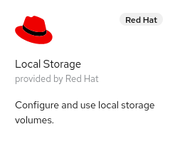
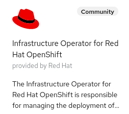

# Red Hat Hypershift on BareMetal

HyperShift is middleware for hosting OpenShift control planes at scale that solves for cost and time to provision, as well as portability cross cloud with strong separation of concerns between management and workloads. Clusters are fully compliant OpenShift Container Platform (OCP) clusters and are compatible with standard OCP and Kubernetes toolchains.  In the following blog I would like to show how one can enable and provision a Hypershift based cluster in OCP.

Before we begin lets start by describing the existing environment of the hub OCP cluster.   This hub cluster is where the Hypershift operator will run and also the control plane of the secondary cluster we deploy with Hypershift.  It is a OCP 4.10.3 compact 3 node cluster running on baremetal.  The following operators have been installed for convience to provide the storage needed for Infrastructure Operator:

    

Along with installing and configuring the above operators we went ahead and set a default storageclass so that any requested persistent volume claims will be fulfilled automatically:

~~~bash
$ oc patch storageclass ocs-storagecluster-ceph-rbd -p '{"metadata": {"annotations":{"storageclass.kubernetes.io/is-default-class":"true"}}}'
storageclass.storage.k8s.io/ocs-storagecluster-ceph-rbd patched
~~~

At this point we can now start to configure this hub cluster for use with Hypershift.  First we need to install two additional operators: Infrastructure Operator for Red Hat OpenShift and Hive.

    

We will be using the community operator for both but in the future Red Hat Advanced Cluster Management for Kubernetes will actually integrate Hypershift and this will not be required.

Once the Hive operator is installed create the basic Hive configiguration yaml below to start the Hive pods:

~~~bash
cat << EOF > ~/hiveconfig.yaml
apiVersion: hive.openshift.io/v1
kind: HiveConfig
metadata:
  name: hive
spec:
  logLevel: debug
  targetNamespace: hive
~~~

Once the yaml is created apply it to the hub cluster:

~~~bash
[bschmaus@provisioning ~]$ oc create -f hiveconfig.yaml 
hiveconfig.hive.openshift.io/hive created
~~~

After a few minutes verify that the pods have started by issuing the following command:

~~~bash
$ oc get po -n hive
NAME                                READY   STATUS    RESTARTS   AGE
hive-clustersync-0                  1/1     Running   0          21m
hive-controllers-76994cf6fd-cw6sr   1/1     Running   0          21m
hiveadmission-9dcd68cf7-ffmzd       1/1     Running   0          21m
hiveadmission-9dcd68cf7-m6sg5       1/1     Running   0          21m

~~~

Once Hive is confirmed to be operatational move onto the Infrastructure Operators configuration.  Here we need to create an agent service configuration file that will tell the operator how much storage we need for the various components like database and filesystem and it will also define what OpenShift versions to maintain:

~~~bash
cat << EOF > ~/agentserviceconfig.yaml
apiVersion: agent-install.openshift.io/v1beta1
kind: AgentServiceConfig
metadata:
  name: agent
spec:
  databaseStorage:
    accessModes:
      - ReadWriteOnce
    resources:
      requests:
        storage: 10Gi
  filesystemStorage:
    accessModes:
      - ReadWriteOnce
    resources:
      requests:
        storage: 100Gi
  imageStorage:
    accessModes:
      - ReadWriteOnce
    resources:
      requests:
        storage: 10Gi
  mustGatherImages:
    - name: cnv
      openshiftVersion: '4.8'
      url: >-
        registry.redhat.io/container-native-virtualization/cnv-must-gather-rhel8:v2.6.5
    - name: ocs
      openshiftVersion: '4.8'
      url: registry.redhat.io/ocs4/ocs-must-gather-rhel8
    - name: lso
      openshiftVersion: '4.8'
      url: registry.redhat.io/openshift4/ose-local-storage-mustgather-rhel8
  osImages:
    - cpuArchitecture: x86_64
      openshiftVersion: '4.8'
      rootFSUrl: >-
        https://mirror.openshift.com/pub/openshift-v4/dependencies/rhcos/4.8/4.8.14/rhcos-live-rootfs.x86_64.img
      url: >-
        https://mirror.openshift.com/pub/openshift-v4/dependencies/rhcos/4.8/4.8.14/rhcos-4.8.14-x86_64-live.x86_64.iso
      version: 48.84.202109241901-0
    - cpuArchitecture: x86_64
      openshiftVersion: '4.9'
      rootFSUrl: >-
        https://mirror.openshift.com/pub/openshift-v4/dependencies/rhcos/4.9/4.9.0/rhcos-live-rootfs.x86_64.img
      url: >-
        https://mirror.openshift.com/pub/openshift-v4/dependencies/rhcos/4.9/4.9.0/rhcos-4.9.0-x86_64-live.x86_64.iso
      version: 49.84.202110081407-0
    - cpuArchitecture: arm64
      openshiftVersion: '4.9'
      rootFSUrl: >-
        https://mirror.openshift.com/pub/openshift-v4/aarch64/dependencies/rhcos/4.9/4.9.0/rhcos-4.9.0-aarch64-live-rootfs.aarch64.img
      url: >-
        https://mirror.openshift.com/pub/openshift-v4/aarch64/dependencies/rhcos/4.9/4.9.0/rhcos-4.9.0-aarch64-live.aarch64.iso
      version: 49.84.202110080947-0
    - cpuArchitecture: x86_64
      openshiftVersion: '4.10'
      rootFSUrl: >-
        https://mirror.openshift.com/pub/openshift-v4/dependencies/rhcos/4.10/4.10.3/rhcos-4.10.3-x86_64-live-rootfs.x86_64.img
      url: >-
        https://mirror.openshift.com/pub/openshift-v4/dependencies/rhcos/4.10/4.10.3/rhcos-4.10.3-x86_64-live.x86_64.iso
      version: 410.84.202201251210-0
EOF
~~~

Once the agent service configuration file is created apply it to the cluster:

~~~bash
[bschmaus@provisioning ~]$ oc create -f agent_service_config-kni20.yaml
agentserviceconfig.agent-install.openshift.io/agent created
~~~

After a few minutes validate that the pods for the Infrastructure operator have started:

~~~bash
$ oc get po -n assisted-installer
NAME                                       READY   STATUS    RESTARTS   AGE
agentinstalladmission-77bf8b8b8f-kcr8m     1/1     Running   0          27m
agentinstalladmission-77bf8b8b8f-ttxbg     1/1     Running   0          27m
assisted-image-service-0                   1/1     Running   0          27m
assisted-service-8876b7d45-9g2fb           2/2     Running   0          27m
infrastructure-operator-76d4b9c58f-ghvds   1/1     Running   0          32m
~~~

With our two operators installed we can move onto patching the provisioning configuration to watch all namespaces:

~~~bash
$ oc patch provisioning provisioning-configuration --type merge -p '{"spec":{"watchAllNamespaces": true}}'
provisioning.metal3.io/provisioning-configuration patched
~~~

At this point we have all the pre-requisites configured for Hypershift to be deployed so now we can proceed with deploying Hypershift on the hub cluster.

~~~bash
NAMESPACE=kni21ns
CLUSTERNAME=kni21
INFRAENV=kni21infra
BASEDOMAIN=pemlab.rdu2.redhat.com
SSHKEY=~/.ssh/id_rsa.pub
PULLSECRETNAME=${INFRAENV}-pullsecret
MACHINE_CIDR_CLUSTER=10.11.176.0/24
OCP_RELEASE_VERSION="4.10.3"
OCP_ARCH="x86_64"
HYPERSHIFT_IMAGE=quay.io/hypershift/hypershift-operator:latest
KUBECONFIG=kubeconfig-kni20
PULLSECRET=pull-secret.json
~~~

~~~bash
$ mkdir /tmp/hypershift
$ cp ~/$KUBECONFIG /tmp/hypershift/
$ cp ~/$PULLSECRET /tmp/hypershift/
$ cd /tmp/hypershift/
~~~

~~~bash
$ podman login quay.io
Username: bschmaus
Password: 
Login Succeeded!
~~~

~~~bash
$ podman pull $HYPERSHIFT_IMAGE
Trying to pull quay.io/hypershift/hypershift-operator:latest...

Getting image source signatures
Copying blob de9bc33d7337 skipped: already exists  
Copying blob effc4ea612c8 skipped: already exists  
Copying blob 495726a4e351 done  
Copying blob ce753a481e9f done  
Copying blob 3b83e4259b50 done  
Copying blob 2de609a6fd40 done  
Copying config 12be255359 done  
Writing manifest to image destination
Storing signatures
12be2553593f133366e0b706c5bbcbab6e90c950b4bb1ea1feb1e25512791a9c
~~~

~~~bash
$ alias hypershift="podman run --net host --rm --entrypoint /usr/bin/hypershift -e KUBECONFIG=/working_dir/$KUBECONFIG -v $HOME/.ssh:/root/.ssh -v /tmp/hypershift:/working_dir $HYPERSHIFT_IMAGE"
~~~

~~~bash
$ hypershift install --hypershift-image $HYPERSHIFT_IMAGE
created PriorityClass /hypershift-control-plane
created PriorityClass /hypershift-etcd
created PriorityClass /hypershift-api-critical
applied Namespace /hypershift
applied ServiceAccount hypershift/operator
applied ClusterRole /hypershift-operator
applied ClusterRoleBinding /hypershift-operator
applied Role hypershift/hypershift-operator
applied RoleBinding hypershift/hypershift-operator
applied Deployment hypershift/operator
applied Service hypershift/operator
applied Role hypershift/prometheus
applied RoleBinding hypershift/prometheus
applied ServiceMonitor hypershift/operator
applied PrometheusRule hypershift/metrics
applied CustomResourceDefinition /clusterresourcesetbindings.addons.cluster.x-k8s.io
applied CustomResourceDefinition /clusterresourcesets.addons.cluster.x-k8s.io
applied CustomResourceDefinition /clusterclasses.cluster.x-k8s.io
applied CustomResourceDefinition /clusters.cluster.x-k8s.io
applied CustomResourceDefinition /machinedeployments.cluster.x-k8s.io
applied CustomResourceDefinition /machinehealthchecks.cluster.x-k8s.io
applied CustomResourceDefinition /machinepools.cluster.x-k8s.io
applied CustomResourceDefinition /machines.cluster.x-k8s.io
applied CustomResourceDefinition /machinesets.cluster.x-k8s.io
applied CustomResourceDefinition /agentclusters.capi-provider.agent-install.openshift.io
applied CustomResourceDefinition /agentmachines.capi-provider.agent-install.openshift.io
applied CustomResourceDefinition /agentmachinetemplates.capi-provider.agent-install.openshift.io
applied CustomResourceDefinition /awsclustercontrolleridentities.infrastructure.cluster.x-k8s.io
applied CustomResourceDefinition /awsclusterroleidentities.infrastructure.cluster.x-k8s.io
applied CustomResourceDefinition /awsclusters.infrastructure.cluster.x-k8s.io
applied CustomResourceDefinition /awsclusterstaticidentities.infrastructure.cluster.x-k8s.io
applied CustomResourceDefinition /awsclustertemplates.infrastructure.cluster.x-k8s.io
applied CustomResourceDefinition /awsfargateprofiles.infrastructure.cluster.x-k8s.io
applied CustomResourceDefinition /awsmachinepools.infrastructure.cluster.x-k8s.io
applied CustomResourceDefinition /awsmachines.infrastructure.cluster.x-k8s.io
applied CustomResourceDefinition /awsmachinetemplates.infrastructure.cluster.x-k8s.io
applied CustomResourceDefinition /awsmanagedmachinepools.infrastructure.cluster.x-k8s.io
applied CustomResourceDefinition /azureclusteridentities.infrastructure.cluster.x-k8s.io
applied CustomResourceDefinition /azureclusters.infrastructure.cluster.x-k8s.io
applied CustomResourceDefinition /azuremachines.infrastructure.cluster.x-k8s.io
applied CustomResourceDefinition /azuremachinetemplates.infrastructure.cluster.x-k8s.io
applied CustomResourceDefinition /ibmpowervsclusters.infrastructure.cluster.x-k8s.io
applied CustomResourceDefinition /ibmpowervsmachines.infrastructure.cluster.x-k8s.io
applied CustomResourceDefinition /ibmpowervsmachinetemplates.infrastructure.cluster.x-k8s.io
applied CustomResourceDefinition /ibmvpcclusters.infrastructure.cluster.x-k8s.io
applied CustomResourceDefinition /ibmvpcmachines.infrastructure.cluster.x-k8s.io
applied CustomResourceDefinition /ibmvpcmachinetemplates.infrastructure.cluster.x-k8s.io
applied CustomResourceDefinition /kubevirtclusters.infrastructure.cluster.x-k8s.io
applied CustomResourceDefinition /kubevirtmachines.infrastructure.cluster.x-k8s.io
applied CustomResourceDefinition /kubevirtmachinetemplates.infrastructure.cluster.x-k8s.io
applied CustomResourceDefinition /awsendpointservices.hypershift.openshift.io
applied CustomResourceDefinition /hostedclusters.hypershift.openshift.io
applied CustomResourceDefinition /hostedcontrolplanes.hypershift.openshift.io
applied CustomResourceDefinition /nodepools.hypershift.openshift.io
~~~

~~~bash
$ oc create namespace $NAMESPACE
namespace/kni21ns created
~~~

~~~bash
cat << EOF > ~/$PULLSECRETNAME.yaml
apiVersion: v1
kind: Secret
type: kubernetes.io/dockerconfigjson
metadata:
  name: $PULLSECRETNAME
  namespace: $NAMESPACE
data:
  .dockerconfigjson: $(cat /tmp/hypershift/pull-secret.json  | base64 -w0)
EOF
~~~

~~~bash
oc create -f ~/$PULLSECRETNAME.yaml
secret/kni21infra-pullsecret created
~~~

~~~bash
cat << EOF > ~/$INFRAENV.yaml
apiVersion: agent-install.openshift.io/v1beta1
kind: InfraEnv
metadata:
  name: $INFRAENV
  namespace: $NAMESPACE
spec:
  pullSecretRef:
    name: $PULLSECRETNAME
  sshAuthorizedKey: $(cat $SSHKEY)
EOF
~~~

~~~bash
$ oc create -f ~/$INFRAENV.yaml
infraenv.agent-install.openshift.io/kni21infra created
~~~

~~~bash
$ oc get po -A|grep -vE 'Completed|Running'
NAMESPACE                                          NAME                                                              READY   STATUS      RESTARTS   AGE

$ oc get infraenv $INFRAENV -n $NAMESPACE -o json| jq -r .status.isoDownloadURL| xargs curl -kI
HTTP/1.1 200 OK
accept-ranges: bytes
content-disposition: attachment; filename=6440f9b6-44c9-452a-a820-906c582290fe-discovery.iso
content-length: 108984320
content-type: application/octet-stream
last-modified: Fri, 01 Apr 2022 14:09:52 GMT
date: Fri, 01 Apr 2022 14:09:52 GMT
set-cookie: 2d419d3e406946976a07970b1abc63e4=08f02ad56798ca18bf051a5067a87038; path=/; HttpOnly; Secure; SameSite=None
cache-control: private
~~~

~~~bash
$ INFRAID=$(oc get infraenv $INFRAENV -n $NAMESPACE -o json| jq -r .status.isoDownloadURL | awk -F/ '{print $NF}'| cut -d \? -f 1)
$ echo $INFRAID
6440f9b6-44c9-452a-a820-906c582290fe
~~~

~~~bash
$ nslookup
> api.kni21.schmaustech.com
Server:		192.168.0.10
Address:	192.168.0.10#53

Name:	api.kni21.schmaustech.com
Address: 192.168.0.215
Name:	api.kni21.schmaustech.com
Address: 192.168.0.213
Name:	api.kni21.schmaustech.com
Address: 192.168.0.214

> test.apps.kni21.schmaustech.com
Server:		192.168.0.10
Address:	192.168.0.10#53

Name:	test.apps.kni21.schmaustech.com
Address: 192.168.0.114
Name:	test.apps.kni21.schmaustech.com
Address: 192.168.0.113
~~~

~~~bash
cat << EOF > ~/hypershift-$CLUSTERNAME-hostedcluster.yaml
apiVersion: hypershift.openshift.io/v1alpha1
kind: HostedCluster
metadata:
  name: ${CLUSTERNAME}
  namespace: ${NAMESPACE}
spec:
  release:
    image: "quay.io/openshift-release-dev/ocp-release:${OCP_RELEASE_VERSION}-${OCP_ARCH}"
  pullSecret:
    name: ${PULLSECRETNAME}
  sshKey:
    name: "${SSHKEY}"
  networking:
    serviceCIDR: "172.31.0.0/16"
    podCIDR: "10.132.0.0/14"
    machineCIDR: "${MACHINE_CIDR_CLUSTER}"
  platform:
    agent:
      agentNamespace: ${NAMESPACE}
    type: Agent
  infraID: ${INFRAID}
  dns:
    baseDomain: ${BASEDOMAIN}
  services:
  - service: APIServer
    servicePublishingStrategy:
      nodePort:
        address: api.${CLUSTERNAME}.${BASEDOMAIN}
      type: NodePort
  - service: OAuthServer
    servicePublishingStrategy:
      nodePort:
        address: api.${CLUSTERNAME}.${BASEDOMAIN}
      type: NodePort
  - service: OIDC
    servicePublishingStrategy:
      nodePort:
        address: api.${CLUSTERNAME}.${BASEDOMAIN}
      type: None
  - service: Konnectivity
    servicePublishingStrategy:
      nodePort:
        address: api.${CLUSTERNAME}.${BASEDOMAIN}
      type: NodePort
  - service: Ignition
    servicePublishingStrategy:
      nodePort:
        address: api.${CLUSTERNAME}.${BASEDOMAIN}
      type: NodePort
EOF
~~~

~~~bash
hostedcluster.hypershift.openshift.io/kni25 created
~~~

~~~bash
cat << EOF ~/hypershift-$CLUSTERNAME-nodepool.yaml
apiVersion: hypershift.openshift.io/v1alpha1
kind: NodePool
metadata:
  name: ${CLUSTERNAME}-workers
  namespace: ${NAMESPACE}
spec:
  clusterName: ${CLUSTERNAME}
  nodeCount: 0
  management:
    autoRepair: false
    upgradeType: Replace
  platform:
    type: Agent
  release:
    image: "quay.io/openshift-release-dev/ocp-release:${OCP_RELEASE_VERSION}-${OCP_ARCH}"
EOF
~~~

~~~bash
nodepool.hypershift.openshift.io/kni25-workers created
~~~
